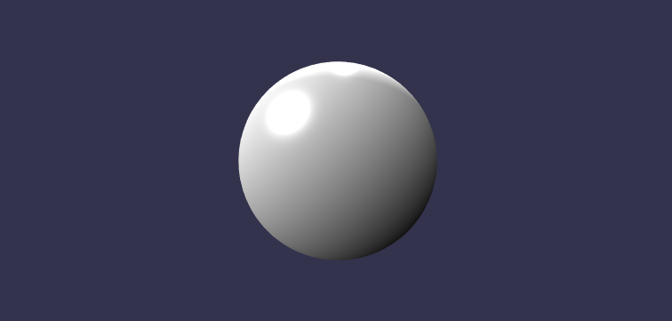
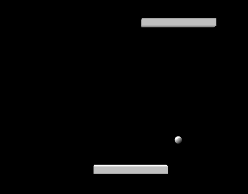

# neo-babylon

<a href="https://docs.rs/neo-babylon"></a>

A WebAssembly wrapper for [BabylonJS](https://www.babylonjs.com/) in Rust. It is a fork of https://github.com/richardanaya/babylon.rs , but using wasm-bindgen and with additional features.

This project currently does not provide bindings to all BabylonJS, but this is not by intent.

Current priorities:

* get a basic GLTF up
* get a camera
* get some sort of interaction

# Idioms
* Scenes hold 3D objects
* Materials determine how a 3D object looks
* When an 3D object drops it's removed from the scene

# HelloWorld

<p align="center">
  
</p>

```rust
use std::{cell::RefCell, rc::Rc};

use js_sys::Math;
use wasm_bindgen::prelude::*;
use babylon::{prelude::*, api};
use web_sys::console;

struct Game {
    scene: Rc<RefCell<Scene>>,
    shapes: Vec<BabylonMesh>,
}

impl Game {
    fn new() -> Self {
        Game {
            scene: api::create_basic_scene("#renderCanvas"),
            shapes: vec![],
        }
    }
}

thread_local! {
    static GAME: RefCell<Game> = RefCell::new(Game::new());
}

#[wasm_bindgen(start)]
pub fn main() {
    console::log_1(&"Starting demo...".into());

    GAME.with(|game| {    

        for i in 0..10 { 
            let sphere = BabylonMesh::create_sphere(&game.borrow().scene.borrow(), format!("sphere_{}", i).as_str(), SphereOptions{ diameter: Some(Math::random() + 0.5), ..Default::default() });
            sphere.set_position(Vector3::new(
                Math::random() - 0.5,
                Math::random() - 0.5,
                Math::random() - 0.5,
            ));        
            game.borrow_mut().shapes.push(sphere);
        }
    });
}
```

See this demo [here](https://richardanaya.github.io/babylon.rs/examples/helloworld/index.html) ( be sure to play with mouse and arrow keys :arrow_left: :arrow_up: :arrow_down: :arrow_right:!)

# Pong in under 150 Lines

<p align="center">
  
</p>


```rust
use neo_babylon::{api, prelude::*};
use js_sys::Math;
use std::cell::RefCell;
use std::{collections::HashSet, rc::Rc};
use wasm_bindgen::prelude::wasm_bindgen;

struct Game {
    scene: Rc<RefCell<Scene>>,
    _camera: ArcRotateCamera,
    _light_1: HemisphericLight,
    _light_2: PointLight,
    ball: BabylonMesh,
    paddle_1: BabylonMesh,
    paddle_2: BabylonMesh,
    paddle_dir: RefCell<f64>,
    ball_dir: Vector3,
    keys: Rc<RefCell<HashSet<u8>>>,
}

impl Default for Game {
    fn default() -> Self {
        // Basic scene setup
        let scene = api::create_scene("#renderCanvas");
        scene.borrow().set_clear_color(Color4::new(0.0, 0.0, 0.0, 1.0));
        let _camera = ArcRotateCamera::default();
        let _light_1 =
            HemisphericLight::new("Light1", Vector3::new(0.0, 0.0, 1.0), &scene.borrow());
        let _light_2 = PointLight::new("Light2", Vector3::new(0.0, 1.0, 0.0), &scene.borrow());

        // Create ball
        let ball = BabylonMesh::create_sphere(
            &scene.borrow(),
            "ball",
            SphereOptions {
                diameter: Some(0.05),
                ..Default::default()
            },
        );

        // Create paddles
        let paddle_mat = StandardMaterial::new("paddle_mat", &scene.borrow());
        paddle_mat.set_diffuse_color(Color3::new(0.1, 0.5, 0.1));
        let paddle_1 = BabylonMesh::create_box(
            &scene.borrow(),
            "paddle_1",
            BoxOptions {
                width: Some(0.5),
                height: Some(0.05),
                depth: Some(0.05),
                ..Default::default()
            },
        );
        paddle_1.set_position(Vector3::new(0.0, 0.5, 0.0));
        paddle_1.set_material(&paddle_mat);
        let paddle_2 = BabylonMesh::create_box(
            &scene.borrow(),
            "paddle_2",
            BoxOptions {
                width: Some(0.5),
                height: Some(0.05),
                depth: Some(0.05),
                ..Default::default()
            },
        );
        paddle_2.set_position(Vector3::new(0.0, -0.5, 0.0));
        paddle_2.set_material(&paddle_mat);

        Game {
            scene,
            _camera,
            _light_1,
            _light_2,
            ball,
            paddle_1,
            paddle_2,
            paddle_dir: RefCell::new(0.0),
            ball_dir: Vector3::new(Math::random() - 0.5, -1.0, 0.0),
            keys: Rc::new(RefCell::new(HashSet::<u8>::new())),
        }
    }
}

impl BasicGame for Game {
    fn get_scene(&self) -> Rc<RefCell<Scene>> {
        self.scene.clone()
    }

    fn get_keys(&self) -> Rc<RefCell<HashSet<u8>>> {
        Rc::clone(&self.keys)
    }

    fn run(&self, delta_time: f64) {
        // Get positions
        let p2 = self.paddle_2.position();
        let bp = self.ball.position();

        // Move ball
        let mut b_x = self.ball_dir.x() * delta_time + bp.x();
        let mut b_y = self.ball_dir.y() * delta_time + bp.y();

        if b_x > 0.75 || b_x < -0.75 {
            self.ball_dir.set_x(-self.ball_dir.x());
        }
        if b_y > 0.75 || b_y < -0.75 {
            // Reset ball if outside play area
            b_x = 0.0;
            b_y = 0.0;
            self.ball_dir.set_x(Math::random() - 0.5);
            self.ball_dir.set_y(-self.ball_dir.y());
        } else if b_y > 0.45 || (b_y < -0.45 && b_y > -0.55 && b_x <= p2.x() + 0.25 && b_x >= p2.x() - 0.25)
        {
            // Hit paddle (top paddle is assumed to always hit)
            self.ball_dir.set_y(-self.ball_dir.y());
            b_y = if b_y > 0.0 { 0.44 } else { -0.44 };
        }

        self.ball.set_position(Vector3::new(b_x, b_y, 0.0));

        // Move opponent paddle to match ball
        self.paddle_1.set_position_x(b_x);

        // Determine direction based on keys down
        if self.keys.borrow().contains(&37) {
            self.paddle_dir.replace(1.0);
        } else if self.keys.borrow().contains(&39) {
            self.paddle_dir.replace(-1.0);
        } else {
            self.paddle_dir.replace(0.0);
        }
        
        // Move paddle if it has velocity
        let p2_x = p2.x() + delta_time * *self.paddle_dir.borrow();
        if p2_x > -0.5 && p2_x < 0.5 {
            self.paddle_2.set_position_x(p2_x);
        }
    }
}

#[wasm_bindgen(start)]
pub fn main() {
    run_basic_game::<Game>();
}
```

See this demo [here](https://richardanaya.github.io/babylon.rs/examples/pong/index.html) 

# Other Demos

* [Timer](https://richardanaya.github.io/babylon.rs/examples/timer/index.html)
* [Keyboard](https://richardanaya.github.io/babylon.rs/examples/keyboard/index.html)

# License

This project is licensed under either of

 * Apache License, Version 2.0, ([LICENSE-APACHE](LICENSE-APACHE) or
   http://www.apache.org/licenses/LICENSE-2.0)
 * MIT license ([LICENSE-MIT](LICENSE-MIT) or
   http://opensource.org/licenses/MIT)

at your option.

### Contribution

Unless you explicitly state otherwise, any contribution intentionally submitted
for inclusion in this library by you, as defined in the Apache-2.0 license, shall be
dual licensed as above, without any additional terms or conditions.
