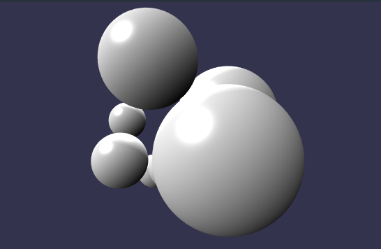

# neo-babylon

<a href="https://docs.rs/neo-babylon"></a>

A WebAssembly wrapper for [Babylon.js](https://www.babylonjs.com/) in Rust. It is largely a fork of https://github.com/richardanaya/babylon.rs, but using wasm-bindgen and with additional features.

This project currently does not provide bindings to all of BabylonJS, but this is not by intent. Please feel free to open issues or pull requests for additional Babylon features.

Current priorities:
* get a basic GLTF up
* get a camera
* get some sort of interaction

Idioms
* Scenes hold 3D objects
* Materials determine how a 3D object looks
* When an 3D object drops it's removed from the scene

# HelloWorld

<p align="center">
  
</p>

```rust
use std::{cell::RefCell, rc::Rc};

use js_sys::Math;
use wasm_bindgen::prelude::*;
use neo_babylon::{prelude::*, api};
use web_sys::console;

struct Game {
    scene: Rc<RefCell<Scene>>,
    shapes: Vec<BabylonMesh>,
}

impl Game {
    fn new() -> Self {
        Game {
            scene: api::create_basic_scene("#renderCanvas"),
            shapes: vec![],
        }
    }
}

thread_local! {
    static GAME: RefCell<Game> = RefCell::new(Game::new());
}

#[wasm_bindgen(start)]
pub fn main() {
    console::log_1(&"Starting demo...".into());

    GAME.with(|game| {    

        for i in 0..10 { 
            let sphere = BabylonMesh::create_sphere(&game.borrow().scene.borrow(), format!("sphere_{}", i).as_str(), SphereOptions{ diameter: Some(Math::random() + 0.5), ..Default::default() });
            sphere.set_position(&Vector3::new(
                Math::random() - 0.5,
                Math::random() - 0.5,
                Math::random() - 0.5,
            ));        
            game.borrow_mut().shapes.push(sphere);
        }
    });
}
```

See this demo [here](https://gsteinltu.github.io/babylon.rs/examples/helloworld/) ( be sure to play with mouse and arrow keys :arrow_left: :arrow_up: :arrow_down: :arrow_right:!)

# Pong in under 140 Lines

<p align="center">
  
</p>


```rust
use neo_babylon::{api, prelude::*};
use js_sys::Math;
use wasm_bindgen::JsCast;
use std::cell::RefCell;
use std::{collections::HashSet, rc::Rc};
use wasm_bindgen::prelude::wasm_bindgen;

struct Game {
    scene: Rc<RefCell<Scene>>,
    _camera: ArcRotateCamera,
    _light_1: HemisphericLight,
    _light_2: PointLight,
    ball: BabylonMesh,
    paddle_1: BabylonMesh,
    paddle_2: BabylonMesh,
    paddle_dir: RefCell<f64>,
    ball_dir: Vector3,
    keys: Rc<RefCell<HashSet<u8>>>,
}

impl Default for Game {
    fn default() -> Self {
        // Basic scene setup
        let scene = api::create_scene("#renderCanvas");
        scene.borrow().set_clear_color(Color4::new(0.0, 0.0, 0.0, 1.0));
        let _camera = ArcRotateCamera::default();
        let _light_1 =
            HemisphericLight::new("Light1", Vector3::new(0.0, 0.0, 1.0), &scene.borrow());
        let _light_2 = PointLight::new("Light2", Vector3::new(0.0, 1.0, 0.0), &scene.borrow());

        // Create ball
        let ball = BabylonMesh::create_sphere(
            &scene.borrow(),
            "ball",
            SphereOptions {
                diameter: Some(0.05),
                ..Default::default()
            },
        );

        // Create paddles
        let paddle_mat = StandardMaterial::new("paddle_mat", &scene.borrow());
        paddle_mat.set_diffuse_color(Color3::new(0.1, 0.5, 0.1));
        let paddle_1 = BabylonMesh::create_box(
            &scene.borrow(),
            "paddle_1",
            BoxOptions {
                width: Some(0.5),
                height: Some(0.05),
                depth: Some(0.05),
                ..Default::default()
            },
        );
        paddle_1.set_position(&Vector3::new(0.0, 0.5, 0.0));
        paddle_1.set_material(&paddle_mat);
        let paddle_2 = BabylonMesh::create_box(
            &scene.borrow(),
            "paddle_2",
            BoxOptions {
                width: Some(0.5),
                height: Some(0.05),
                depth: Some(0.05),
                ..Default::default()
            },
        );
        paddle_2.set_position(&Vector3::new(0.0, -0.5, 0.0));
        paddle_2.set_material(&paddle_mat);

        Game {
            scene,
            _camera,
            _light_1,
            _light_2,
            ball,
            paddle_1,
            paddle_2,
            paddle_dir: RefCell::new(0.0),
            ball_dir: Vector3::new(Math::random() - 0.5, -1.0, 0.0),
            keys: Rc::new(RefCell::new(HashSet::<u8>::new())),
        }
    }
}

impl BasicGame for Game {
    fn get_scene(&self) -> Rc<RefCell<Scene>> {
        self.scene.clone()
    }

    fn get_keys(&self) -> Rc<RefCell<HashSet<u8>>> {
        Rc::clone(&self.keys)
    }

    fn update(&self, delta_time: f64) {
        // Get positions
        let p2 = self.paddle_2.position();
        let bp = self.ball.position();

        // Calculate new ball position
        let bp_new = self.ball_dir.unchecked_ref::<Vector3>() * delta_time + bp;

        if bp_new.x() > 0.75 || bp_new.x() < -0.75 {
            self.ball_dir.set_x(-self.ball_dir.x());
        }
        if bp_new.y() > 0.75 || bp_new.y() < -0.75 {
            // Reset ball if outside play area
            bp_new.set_x(0.0);
            bp_new.set_y(0.0);
            self.ball_dir.set(Math::random() - 0.5, -self.ball_dir.y(), 0.0);
        } else if bp_new.y() > 0.45 || (bp_new.y() < -0.45 && bp_new.y() > -0.55 && bp_new.x() <= p2.x() + 0.25 && bp_new.x() >= p2.x() - 0.25) {
            // Hit paddle (top paddle is assumed to always hit)
            self.ball_dir.set_y(-self.ball_dir.y());
            bp_new.set_y(if bp_new.y() > 0.0 { 0.44 } else { -0.44 });
        }

        self.ball.set_position(&bp_new);

        // Move opponent paddle to match ball
        self.paddle_1.set_position_x(bp_new.x());

        // Determine direction based on keys down
        match self.keys.borrow() {
            x if x.contains(&37) => self.paddle_dir.replace(1.0),
            x if x.contains(&39) => self.paddle_dir.replace(-1.0),
            _ => self.paddle_dir.replace(0.0)
        };
        
        // Move paddle if it has velocity
        let p2_x = p2.x() + delta_time * *self.paddle_dir.borrow();
        if p2_x > -0.5 && p2_x < 0.5 {
            self.paddle_2.set_position_x(p2_x);
        }
    }
}

#[wasm_bindgen(start)]
pub fn main() {
    run_basic_game::<Game>();
}
```

See this demo [here](https://gsteinltu.github.io/babylon.rs/examples/pong/) 

# Other Demos

* [Timer](https://gsteinltu.github.io/babylon.rs/examples/timer/)
* [Keyboard](https://gsteinltu.github.io/babylon.rs/examples/keyboard/)

# License

This project is licensed under either of

 * Apache License, Version 2.0, ([LICENSE-APACHE](LICENSE-APACHE) or
   http://www.apache.org/licenses/LICENSE-2.0)
 * MIT license ([LICENSE-MIT](LICENSE-MIT) or
   http://opensource.org/licenses/MIT)

at your option.

### Contribution

Unless you explicitly state otherwise, any contribution intentionally submitted
for inclusion in this library by you, as defined in the Apache-2.0 license, shall be
dual licensed as above, without any additional terms or conditions.
